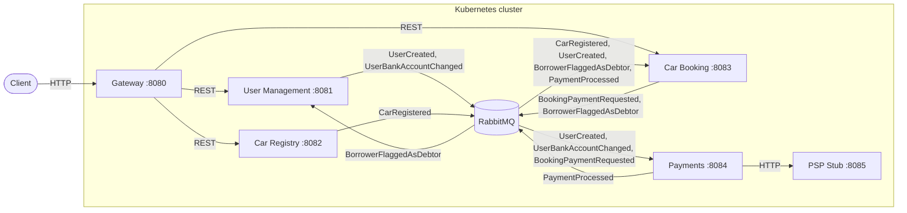

# Car Sharing

A backend-only car-sharing platform built as a demonstration of **spec-driven development** — a methodology for building production-quality software from a formal specification using AI-assisted tooling.

## Contents

1. [What the app is](#1-what-the-app-is)
2. [How it was built](#2-how-it-was-built)
3. [Architecture](#3-architecture)
4. [Data](#4-data)
5. [External services](#5-external-services)
6. [Infrastructure](#6-infrastructure)
7. [Observability](#7-observability)
8. [Build, run, and test](#8-build-run-and-test)
9. [Troubleshooting](#9-troubleshooting)
10. [Known gaps](#10-known-gaps)

## 1. What the app is

Car Sharing is an MVP backend platform that enables owners to lend cars to borrowers. It exposes REST endpoints for user management, car registration, and car booking, and handles payment processing through an external Payment Service Provider (PSP). There is no frontend; the system is exercised via HTTP through the Gateway. The scope is intentionally narrow: the goal is a clean, verifiable backend that demonstrates the methodology used to build it.

## 2. How it was built

This project was built following a spec-driven development process designed to produce a formal specification *before* any code is written, then use AI-assisted tooling to implement it phase by phase.

1. Draft an informal app description (`app-definition.md`).
2. Feed it to Gemini to generate a Technical Specification Document (TSD).
3. Refine the TSD iteratively with Gemini; rerun from scratch to eliminate bias.
4. Ask Claude Code to format the final TSD as `SPEC.md` — the single source of truth.
5. Scaffold a Java/Spring multi-module project and run `/init` in Claude Code.
6. Install supporting tooling: Context7 for live docs lookup; custom skills for TDD, hexagonal architecture, Effective Java, clean code, and ADR authoring; a `DocsExplorer` subagent.
7. Configure `CLAUDE.md` to bind Claude Code to the spec and tooling conventions.
8. Plan the implementation as phased GitHub issues, stress-tested with the `grill-me` skill.
9. Implement each phase with TDD; produce ADRs and service READMEs along the way.

Full step-by-step process: [`.claude/specs/other/spec-driven-dev.md`](.claude/specs/other/spec-driven-dev.md).

## 3. Architecture

Six Spring Boot services communicate through a Gateway. Reads are synchronous REST; writes propagate asynchronously via RabbitMQ. The Booking service owns a Saga orchestrator that drives the booking lifecycle from `PENDING` to `ACTIVE` or `CANCELLED`.



### Services

| Service | Port | Responsibility |
|---|---|---|
| [Gateway](services/gateway/README.md) | 8080 | Single inbound entry point; routes all HTTP |
| [User Management](services/user-management/README.md) | 8081 | Admin CRUD for users; tracks debtor status |
| [Car Registry](services/car-registry/README.md) | 8082 | Car registration; publishes car events |
| [Car Booking](services/car-booking/README.md) | 8083 | Booking lifecycle + Saga orchestrator; CQRS read model for available cars |
| [Payments](services/payments/README.md) | 8084 | Account management; charges bookings via PSP |
| [PSP Stub](services/psp-stub/README.md) | 8085 | Local simulator for the external Payment Service Provider |

### Saga flow

Owned by Car Booking:

```
POST /bookings
  → booking saved as PENDING
  → BookingPaymentRequested published to RabbitMQ
  → Payments charges the PSP
  → PaymentProcessed(SUCCESS | FAILED) published
  → booking updated to ACTIVE or CANCELLED

Every 15 min (scheduler):
  → overdue ACTIVE bookings found (end date passed, car not yet returned)
  → BorrowerFlaggedAsDebtor published per borrower not already a debtor
```

### Key design decisions

- **Hexagonal architecture** per service — domain logic is isolated from infrastructure via ports and adapters.
- **CQRS read model** in Car Booking: `GET /cars` queries a local copy of cars synced from Registry via RabbitMQ, avoiding cross-service joins.
- **Pessimistic locking** on car rows prevents double-booking under concurrent requests.

## 4. Data

Each service owns a dedicated SQLite database; no cross-schema joins are permitted.

| Service | Database | Tables |
|---|---|---|
| User Management | `user-management.db` | `users` (`id`, `username`, `name`, `surname`, `bank_account`, `is_debtor`) |
| Car Registry | `car-registry.db` | `cars` (`id`, `owner_id`, `type`, `registration_number`) |
| Car Booking | `car-booking.db` | `users` (`id`, `is_debtor`), `cars` (`id`, `type`), `bookings` (`id`, `car_id`, `borrower_id`, `start_date`, `end_date`, `status`) |
| Payments | `payments.db` | `accounts` (`id`, `user_id`, `bank_account`), `transactions` (`id`, `booking_id`, `borrower_id`, `amount`, `status`) |

Booking status values: `PENDING` / `ACTIVE` / `RETURNED` / `CANCELLED`.
Transaction status values: `SUCCESS` / `FAILED`.

## 5. External services

The Payments service calls a Payment Service Provider (PSP) over HTTP to charge borrowers. The fee is 10 EUR × number of booked days.

| Endpoint | `200 OK` | `409 Conflict` |
|---|---|---|
| `POST /process` | Payment accepted | Insufficient funds |
| `GET /balances` | All account balances | — |

In production this would be a real banking API. Locally, `psp-stub` simulates it: a Spring Boot service that holds in-memory account balances seeded at startup and decrements them on each successful charge. No code inside Payments distinguishes between the stub and a real PSP. See [ADR-002](doc/decisions/ADR-002-psp-stub-as-external-service-simulator.md) for the full rationale.

## 6. Infrastructure

The platform runs on a local Kubernetes cluster (tested with Colima + k3s). Each service has a manifest under `services/<name>/infra/`. Shared cluster resources live under `infra/`:

| Manifest | Purpose |
|---|---|
| `infra/namespace.yaml` | `car-sharing` namespace |
| `infra/configmap.yaml` | Shared config (RabbitMQ URL, OTLP endpoint) |
| `infra/rabbitmq.yaml` | RabbitMQ broker |
| `infra/openobserve.yaml` | OpenObserve observability backend |
| `infra/openobserve-alert-setup.yaml` | Alert rules provisioned via Kubernetes Job on startup |

## 7. Observability

Each service emits three signals, all ingested by [OpenObserve](https://openobserve.ai) running at port 5080:

- **Traces** — zero-code OTel Java agent (OTLP/gRPC). Spans cover inbound HTTP requests, RabbitMQ consumer handlers, and Saga steps.
- **Logs** — structured JSON via SLF4J/Logback. `INFO` for state transitions; `WARN` for RabbitMQ redeliveries (see [ADR-001](doc/decisions/ADR-001-rabbitmq-redelivery-logging.md)); `ERROR` for unhandled failures.
- **Metrics** — Micrometer gauges exported via OTLP. Custom metrics defined per service (see each service's `README.md`); platform-level metrics include `bookings.active.current` (Car Booking) and `users.debtors.current` (User Management).

OpenObserve is deployed automatically by `scripts/deploy.sh`. Once the cluster is up, import the pre-built dashboard:

```bash
./scripts/provision-dashboards.sh
```

This loads `dashboards/car-sharing.json` into OpenObserve and overwrites any existing version.

## 8. Build, run, and test

### Prerequisites

- Java 21
- Docker with buildx support
- `kubectl` pointed at a local cluster (Colima + k3s recommended)
- `jq` (required by `provision-dashboards.sh`)

### Build and test

```bash
./gradlew build           # compile + test all modules
./gradlew clean build     # clean build
./gradlew test --tests "com.example.cs.SomeTest"         # single class
./gradlew test --tests "com.example.cs.SomeTest.method"  # single method
```

### Run locally

Before the first deploy, create a `.env` file from the provided example and fill in real SMTP credentials:

```bash
cp .env.example .env
# edit .env — set ZO_SMTP_HOST, ZO_SMTP_USER_NAME, ZO_SMTP_PASSWORD, ZO_SMTP_FROM_EMAIL
```

`deploy.sh` reads this file to create the `openobserve-smtp` Kubernetes Secret. OpenObserve uses that Secret when the `openobserve-alert-setup` Job runs: it provisions an email notification destination and wires it to the high-debtor-ratio alert. Without the Secret, the Job will create the alert but email delivery will silently fail. The `.env` file is listed in `.gitignore` and must never be committed.

```bash
colima start --kubernetes          # start local cluster
./scripts/build-images.sh          # build Docker images and load into local daemon
./scripts/deploy.sh                # apply manifests, restart pods (reads .env)
./scripts/provision-dashboards.sh  # import OpenObserve dashboard
```

### Accessing the cluster

Services inside the cluster are not exposed externally. Use `kubectl port-forward` to reach them from localhost. Each command blocks the terminal — run each in a separate shell or background it.

**OpenObserve** (dashboards, logs, traces, metrics, alerts):

```bash
kubectl port-forward svc/openobserve 5080:5080 -n car-sharing
```

Then open `http://localhost:5080` in a browser.

**Gateway** (all API operations — see each service's `README.md` for endpoint details):

```bash
kubectl port-forward svc/gateway 8080:8080 -n car-sharing
```

All HTTP requests go to `http://localhost:8080`.

### Inspecting service databases

Each service stores its SQLite database at `/app/data/<service>.db` inside the pod. To open an interactive SQLite shell:

```bash
# Car Booking
kubectl exec -it deployment/car-booking -n car-sharing -- \
  sh -c 'apk add --no-cache sqlite 2>/dev/null; sqlite3 /app/data/car-booking.db'

# User Management
kubectl exec -it deployment/user-management -n car-sharing -- \
  sh -c 'apk add --no-cache sqlite 2>/dev/null; sqlite3 /app/data/user-management.db'

# Car Registry
kubectl exec -it deployment/car-registry -n car-sharing -- \
  sh -c 'apk add --no-cache sqlite 2>/dev/null; sqlite3 /app/data/car-registry.db'

# Payments
kubectl exec -it deployment/payments -n car-sharing -- \
  sh -c 'apk add --no-cache sqlite 2>/dev/null; sqlite3 /app/data/payments.db'
```

### Teardown

```bash
./scripts/teardown.sh   # destroys the namespace and all PVC data — irreversible
```

## 9. Troubleshooting

**`kubectl`: connection refused / `dial tcp 127.0.0.1:XXXXX: connect: connection refused`**

The Kubernetes API server is unreachable. Either Colima is not running or the kubeconfig is stale.

```bash
colima status               # check whether the VM is up
colima start --kubernetes   # start it if not running
colima kubernetes reset     # re-merge kubeconfig if Colima is running but kubectl still fails
kubectl cluster-info        # verify connectivity before retrying deploy.sh
```

## 10. Known gaps

The following issues and improvements (sourced from [`.claude/specs/SPEC.md §7`](.claude/specs/SPEC.md) and open GitHub issues) should be addressed before tackling any post-MVP work:

- **Security — full OWASP Top 10 audit** ([#14](https://github.com/Josuto/car-sharing/issues/14)) — a full audit identified multiple findings across Critical, High, and Medium severity. See the issue for the complete list and recommended remediation order.

- **Saga integration test** ([#12](https://github.com/Josuto/car-sharing/issues/12)) — no test exercises the full Saga round-trip across Car Booking and Payments. A dedicated `integration-tests` Gradle module using Testcontainers (RabbitMQ), in-memory SQLite, WireMock (PSP stub), and Awaitility is needed to cover the happy path (`ACTIVE`) and failed-payment path (`CANCELLED`).

- **Eventual consistency on car availability** — propagation delay between a car being registered or returned and it appearing in `GET /cars` due to RabbitMQ async delivery. Possible mitigations: optimistic UI, backend double-checks, or message versioning.

- **Dual-write risk in the Saga** — `CreateBookingHandler` (save booking + publish `BookingPaymentRequested`) and `ProcessPaymentHandler` (save transaction + publish `PaymentProcessed`) both perform a DB write followed by a RabbitMQ publish without atomicity. If the publish fails after a successful write, the event is lost and the Saga stalls. The Outbox pattern resolves this (see ADR-004).

- **PSP mock lacks realism** — the stub has no configurable latency or error profiles. Defining explicit timeout and failure scenarios would make payment testing more representative.
