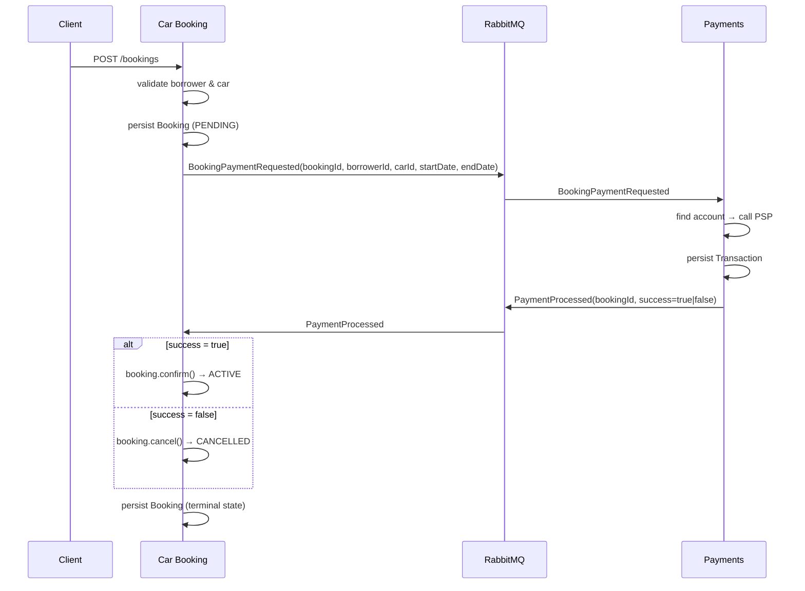

# ADR-004: Choreography-based Saga for the booking distributed transaction

## Status
Accepted

## Date
2026-06-05

## Context
Creating a booking involves two bounded contexts: Car Booking and Payments. The full transaction
must be atomic in the business sense — a booking should only become active if the payment
succeeds, and should be cancelled otherwise. Traditional ACID transactions cannot span service
boundaries, so a Saga is used to coordinate the distributed transaction.

Two well-known Saga styles exist: **orchestration** and **choreography**. Both must be evaluated
before committing to one.

> **Note on terminology:** SPEC.md §3.2 refers to a "Saga Orchestrator located in the Booking
> Service." This is a loose use of the term: what is implemented is a choreography-based Saga
> where the Car Booking service acts as initiator and terminator of the Saga, not a central
> orchestrator that directly commands other services.

## Decision
Use a **choreography-based Saga** coordinated via RabbitMQ events. The Car Booking service
initiates and terminates the Saga; participants communicate exclusively through domain events.

### How it works

The `bookingId` is threaded through both events as the correlation key that allows the Car
Booking service to locate and update the correct booking when the payment result arrives.

The car automatically becomes available again once the booking reaches `CANCELLED`, because the
`GET /cars` query excludes only `PENDING` and `ACTIVE` bookings.

## Alternatives Considered

### Orchestration-based Saga
A central Saga orchestrator (a dedicated service, or an orchestration framework such as Temporal,
Conductor, or AWS Step Functions) explicitly commands each participant in sequence and issues
compensating transactions on failure. The full workflow is encoded in the orchestrator.

- **Pros:**
  - The complete Saga workflow is visible in one place — easier to read, debug, and reason about.
  - Timeouts, retries, and compensating transactions are managed centrally.
  - Adding a new Saga step (e.g., a third participant) requires updating only the orchestrator.
- **Cons:**
  - Requires a dedicated orchestrator service or a heavyweight framework. Both add significant
    infrastructure and operational overhead disproportionate to the size of this project.
  - The orchestrator is coupled to every Saga participant, making it a potential bottleneck and
    single point of failure.
  - Compensating transactions must be explicitly designed and implemented for every failure mode,
    which adds implementation surface.
- **Rejected:** The infrastructure cost is not justified for a two-participant Saga that already
  has RabbitMQ available. Choreography achieves the same outcome with the existing infrastructure.

## Consequences
- **Pros:**
  - No additional infrastructure required beyond the already-present RabbitMQ setup.
  - Each service reacts only to the events it cares about; coupling is limited to shared event DTOs
    in the `common` module.
  - The Saga can be extended (e.g., adding a third participant) by introducing new event
    producers and consumers without changing a central orchestrator.
- **Cons:**
  - The full Saga flow is implicit — it must be reconstructed by reading code across two services.
    Mitigated by distributed tracing (OTel, see issue #9) which correlates spans across services.
  - No centralised Saga state means stuck `PENDING` bookings are not self-healing. Accepted as an
    MVP limitation and documented in ADR-003.
  - As the number of Saga participants grows, the event graph becomes harder to follow. Revisit
    this decision if a third participant is introduced.

## Known Gap: dual-write risk at event publication points

The Saga has two points where a database write and a RabbitMQ publish are performed as separate,
non-atomic operations:

1. **Car Booking — `CreateBookingHandler`:** `bookingRepository.save(booking)` followed by
   `publisher.publish(BookingPaymentRequested)`.
2. **Payments — `ProcessPaymentHandler`:** `transactionRepository.save(transaction)` followed by
   `publisher.publish(PaymentProcessed)`.

If the DB write succeeds but the publish fails at either point, the event is lost and the Saga
stalls. This is the same failure mode documented in ADR-003 for stuck `PENDING` bookings.

The **Outbox pattern** would eliminate this risk by writing the event payload to an `outbox` table
in the same DB transaction as the business record, then having a background poller publish and
delete outbox rows. Atomicity is guaranteed at the DB level; the broker becomes a best-effort
delivery target.

This is not implemented in the MVP due to the added complexity (new table, poller, idempotent
consumer handling). It is listed as a potential improvement in SPEC.md §7 and should be revisited
before moving toward production use.
